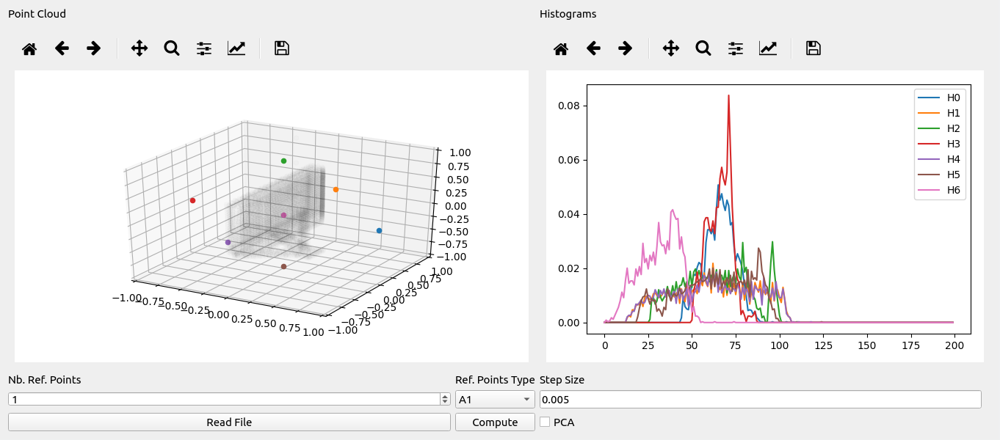

About
===============================

This repository contains the implementation of the Reference Points' Histograms Shape Descriptor (RPHSD) library, a visualization tool, implementation to test the method using the University of Washington RGB-D and the Princeton's ModelNet dataset and the obtained descriptors.

1 Method
===============================

For a given 3D point cloud, a set of reference points and a step size, the method basically:
* Computes a histogram of distances for each reference point from its distance to each cloud point;
* From each histogram, computes statistical features;
* Fill the descriptor with each feature.

The method's complexity is _O(kn)_, where _k_ is the number of reference points and _n_ is the size of the point cloud.

2 Visualization Tool
===============================

Located in the folder `VisTool`, the visualization tool enables the user to see the histograms and the reference points for each point cloud on an interactive interface (Figure 1). This tool still works only with ASCII pcd files.

_Figure 1. VisTool interface._

This tool was developed in Python 3.6.5.

## 2.1 Components

The program interface contains the following components:
* Spinbox `Nb. Ref. Points`: the number of reference points computed if the reference points' type is "kmeans";
* Combobox `Ref. Points Type`: the type/arrangement of the reference points. _A1_, _A2_, _A3_ and _simple_ are static reference points. _kmeans_ computes reference points based on the selected number of reference points in the spinbox `Nb. Ref. Points`.
* Text field `Step Size`: the step size used to compute each histogram.
* Button `Read File`: reads a point cloud file.
* Button `Compute`: computes the histograms of the read point cloud.
* Checkbox `PCA`: reorientates the point cloud based on the PCA transform.

## 2.2 How to Use
To run the tool, simply hit `python main.py`. 

On the user interface, click `Read File` to select the cloud which is going to have its histograms computed. After that, select the desired reference points' type and, if the type is `kmeans`, insert the number of reference points. Changing the step size or checking PCA are optional steps. Finally, hit `Compute` to proceed.

## 2.3 Dependencies
 
* `numpy`;
* `scipy`; 
* `matplotlib`;
* `pyqt5`;
* `pyqtgraph`;
* `sklearn`.

3 Dataset Tests
===============================

The method was tested using the [University of Washington RGB-D Dataset](https://rgbd-dataset.cs.washington.edu/) and the [Princeton's ModelNet (10) Dataset](http://modelnet.cs.princeton.edu/).

## 3.1 Extracting Descriptors
Source-code used for extracting the descriptors is located on `Run-Dataset-Experiments`. In this folder, `MN-DS` and `UW-DS` contain the code used to extract the descriptors for the ModelNet and the University of Washington datasets, respectively. To run the method for each dataset, inside `MN-DS` or `UW-DS`, type `bash scripts/run.sh`. However, you might want to set some parameters before doing that. Open `scripts/run.sh` on your favorite text editor and change:
* `DS_PATH`: the location  where the classes are located at. For instance, `/home/user/Documents/rgbd-dataset/`. Must finish with `/`.
* `MAX_NUM_JOBS`: the number of jobs running simultaneously.
* `OUTPUT_PATH`: the location where the descriptors are going to be written. Must finish with `/`.

Still, if the user wants to skip the feature extraction step, in the folder `Computed-Descriptors` at the root of this repository, the features computed for the paper are already provided.
 
## 3.2 Classification

4 RPHSD C++ Library
===============================
 
